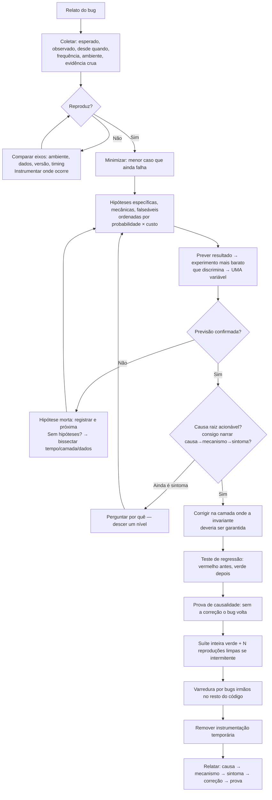

# DEBUGGING.md — Metodologia Completa de Depuração de um Agente de IA

> Engenharia reversa do comportamento observável ao investigar e corrigir bugs. O método é científico no sentido literal: reprodução, hipótese, experimento, eliminação, prova. Parte da série iniciada em `WORKFLOW.md`.

---

## Índice

1. [O modelo mental: depurar é ciência experimental](#1-o-modelo-mental)
2. [Como reproduzir](#2-como-reproduzir)
3. [Como levantar hipóteses](#3-como-levantar-hipóteses)
4. [Como eliminar hipóteses](#4-como-eliminar-hipóteses)
5. [Como encontrar a causa raiz](#5-como-encontrar-a-causa-raiz)
6. [Como confirmar a correção](#6-como-confirmar-a-correção)
7. [Como evitar regressões](#7-como-evitar-regressões)
8. [Como depurar sistemas grandes](#8-como-depurar-sistemas-grandes)
9. [Erros humanos a evitar](#9-erros-humanos-a-evitar)
10. [Fluxo completo em diagrama](#10-fluxo-completo-em-diagrama)
11. [Kit de ferramentas mentais](#11-kit-de-ferramentas-mentais)

---

## 1. O modelo mental

Um bug é uma discrepância entre o **modelo mental** (o que o código deveria fazer) e a **realidade** (o que ele faz). Como a realidade nunca está errada, **o bug mora sempre no modelo mental** — meu, do autor, ou de quem escreveu o requisito. Depurar é o processo de encontrar exatamente onde o modelo diverge da realidade.

Consequências práticas desse enquadramento:

- **Evidência vence teoria, sempre.** Quando o log contradiz minha explicação, a explicação morre na hora.
- **"Impossível" é a palavra mais informativa da depuração.** Quando digo "mas isso é impossível", acabo de localizar a fronteira do meu modelo errado — é exatamente ali que se deve cavar.
- **Cada experimento serve para partir o espaço de busca**, não para confirmar o que já acredito. Um bom experimento é o que pode me provar errado.
- **A primeira leitura do erro é literal.** A mensagem de erro diz o que aconteceu; a tentação humana (e de IA) é *interpretá-la* — encaixá-la num padrão conhecido — em vez de *lê-la*.

---

## 2. Como reproduzir

**Regra absoluta: sem reprodução não há depuração — há mudança de código acompanhada de esperança.**

### 2.1 Coleta do relato

Antes de tocar em qualquer código, extraio do relato (ou pergunto, ou descubro):

- **Esperado vs observado** — precisos, não "não funciona".
- **Desde quando** — sempre foi assim, ou começou? Se começou: o que mudou perto da data (deploy, dependência, config, dados, volume)?
- **Frequência** — sempre? intermitente? só para certos usuários/dados/horários?
- **Ambiente** — produção/staging/local? versão? browser/OS quando relevante?
- **A evidência crua** — o stack trace inteiro, o log em volta, a requisição exata. Paráfrases perdem exatamente o detalhe que importa.

### 2.2 Construir a reprodução

1. Tento reproduzir localmente com os dados/passos do relato.
2. Se não reproduz localmente: comparo os eixos ambiente/dados/versão/timing um a um até achar o eixo que dispara.
3. Se só reproduz "lá" (produção): instrumento — logs temporários **direcionados por hipótese** (não um `print` a cada linha) — para capturar o estado no momento da falha.
4. Bug intermitente: procuro o gatilho de não-determinismo (concorrência, ordem, relógio, cache, dados) e forço-o (rodar em loop, injetar atraso, fixar seed).

### 2.3 Minimizar a reprodução

Com a reprodução na mão, **encolho-a**: removo passos, campos, dados e flags até o menor caso que ainda falha.

- Cada elemento removido sem o bug sumir = um suspeito inocentado de graça.
- O elemento cuja remoção faz o bug sumir = a vizinhança da causa.
- O caso mínimo vira, quase pronto, o futuro teste de regressão.

---

## 3. Como levantar hipóteses

### 3.1 Fontes de hipóteses, em ordem de consulta

1. **A mensagem de erro e o stack trace** — lidos por inteiro, palavra por palavra. Identifico o primeiro frame que é código do projeto (não de biblioteca): é o ponto de entrada da investigação. A resposta está literalmente escrita ali com frequência embaraçosa.
2. **O diff temporal** — "funcionava antes" transforma a pergunta em "o que mudou?": `git log` no período, changelog de dependências atualizadas, mudanças de config/infra, mudança nos *dados*.
3. **A anatomia do sintoma** — cada tipo de sintoma tem suspeitos clássicos:
   - Intermitente → concorrência, timing, cache, ordem, dados específicos.
   - Só em produção → config/env, volume, dados reais, paralelismo real, versão.
   - Só na primeira vez / só na segunda → inicialização, cache, estado residual.
   - Off-by-one no resultado → limite de loop, índice, arredondamento, timezone.
   - Falha a cada N ou após tempo T → limite de recurso, expiração, overflow, pool esgotado.
   - "Dado errado mas parecido" → registro trocado (WHERE errado), cache servindo o item errado, raça.
4. **O conhecimento do domínio do código** — o que este módulo notoriamente faz de arriscado (parsing, datas, dinheiro, concorrência)?

### 3.2 Forma de uma boa hipótese

Uma hipótese utilizável é **específica, mecânica e falseável**:

- ❌ "Deve ser algo no cache" — não testável.
- ✅ "O cache guarda a resposta sem o tenant na chave; por isso o usuário B recebe os dados do A quando as requisições intercalam" — específica (onde), mecânica (como), falseável (prevê: com cache desligado, some; a chave no código não contém tenant).

### 3.3 Ordenação

Ordeno as hipóteses por **probabilidade × custo do experimento**: testo primeiro a provável-e-barata. E mantenho sempre **pelo menos duas hipóteses vivas** — quem tem uma só a defende; quem tem duas as testa.

---

## 4. Como eliminar hipóteses

### 4.1 As regras do experimento

1. **Uma variável por experimento.** Mudar três coisas e o bug sumir não ensina nada — não sei qual foi, e posso ter escondido em vez de corrigido.
2. **Prever antes de rodar.** Escrevo (mesmo que mentalmente) a previsão: "se H é verdadeira, este log mostrará X". Sem previsão registrada, todo resultado "confirma" alguma coisa — é assim que se persegue fantasmas.
3. **O experimento mais barato que discrimina.** Um log bem posicionado > um debugger configurado > um teste novo > um deploy de tentativa. Mas sempre o barato **que separa H de não-H** — barato e não-discriminante é desperdício.
4. **Resultado contrário mata a hipótese — sem remendos.** Se previ X e veio Y, a hipótese morreu. A tentação de remendá-la ("ah, mas talvez o log esteja no lugar errado...") é o começo do ciclo vicioso; remendo só com evidência independente.

### 4.2 Bisseção — a arma universal

Quando as hipóteses acabam ou o espaço é grande demais, bissecto — corto o espaço de busca pela metade repetidamente:

- **No tempo:** `git bisect` com script de reprodução — "algum commit em 3 semanas" vira O(log n) execuções.
- **Nas camadas:** o dado está certo no banco? na saída do repositório? na resposta do serviço? no JSON serializado? na tela? O bug mora entre a última camada boa e a primeira ruim.
- **Nos dados:** falha com o dataset inteiro — e com metade? qual metade? (repetir até o registro específico).
- **No código:** desligar metade das features/plugins/middlewares; comentar metade do pipeline.

### 4.3 Registro do que foi eliminado

Mantenho a lista de hipóteses mortas e a evidência que as matou. Evita repetir experimentos em investigações longas e constrói o mapa negativo ("o bug NÃO é X nem Y") — que frequentemente aponta sozinho para o que sobra.

---

## 5. Como encontrar a causa raiz

### 5.1 A distinção sintoma → mecanismo → causa

- **Sintoma:** o que o usuário vê (página quebra).
- **Mecanismo:** a cadeia técnica (campo `name` é `undefined` → template lança).
- **Causa raiz:** a decisão/omissão que permitiu o estado inválido (a importação aceita payload sem `name` porque o schema não valida).

Correção no sintoma = curativo. Correção na causa = cura. A investigação só termina quando alcanço uma causa **acionável** — algo que, mudado, impede a classe inteira do problema.

### 5.2 Os "cinco porquês" aplicados a código

> Página quebra. **Por quê?** `user.name` é undefined. **Por quê?** a API retornou usuário sem nome. **Por quê?** a rota de importação gravou usuário sem nome. **Por quê?** o schema de importação não exige `name`. **Por quê?** o schema foi copiado do schema de atualização parcial, onde tudo é opcional. → **Causa raiz:** reuso indevido de schema; **correção:** schema próprio de importação com campos obrigatórios; **varredura:** que outras rotas reusam esse schema?

Paro de perguntar "por quê" quando a resposta deixa de ser técnica e vira organizacional além do meu alcance — mas registro esse nível no relatório ("a causa sistêmica é a ausência de validação em todas as rotas de importação; corrigi as três existentes").

### 5.3 Classificação da causa (aponta onde corrigir)

| Tipo de causa | Descrição | Correção mora em |
|---|---|---|
| **Defeito** | O código nunca fez o certo nesse caso | No código + teste do caso |
| **Decadência** | O mundo mudou (dependência, API externa, formato de dado, volume) | Na fronteira com o mundo + monitoramento |
| **Mal-entendido** | O código faz o que foi mandado; o requisito era outro | Na especificação/validação com o usuário — **não** sair "corrigindo" |
| **Raça/ambiente** | Correto em isolamento, errado em concorrência/config real | No design de concorrência/config, não no ponto do sintoma |

---

## 6. Como confirmar a correção

A correção só é declarada quando a **cadeia de prova** fecha:

1. **A explicação mecânica existe:** consigo narrar causa → mecanismo → sintoma passo a passo. Se não consigo explicar *por que* a mudança corrige, ela não corrige — coincide.
2. **A reprodução original passa** com a correção aplicada.
3. **A prova de causalidade:** removendo a correção, o bug **volta**. (Sem isso, o bug pode ter "sumido" por outro motivo — cache, dado, ordem.)
4. **O teste de regressão** derivado da reprodução mínima: falha sem a correção, passa com ela — verificado de fato, não presumido.
5. **A suíte inteira relevante passa** — a correção não pode quebrar outra coisa.
6. **Intermitentes exigem estatística:** N execuções limpas consecutivas da reprodução forçada (dezenas/centenas para raças), não uma.
7. **A varredura por irmãos:** o mesmo padrão de erro quase sempre foi cometido em mais lugares (mesmo copy-paste, mesma API mal usada, mesmo schema reusado). Busco e corrijo — ou reporto — as instâncias irmãs.

---

## 7. Como evitar regressões

- **Todo bug corrigido deixa um teste** que o representa — derivado da reprodução mínima, nomeado pelo cenário (`test_importacao_rejeita_usuario_sem_nome`), e comprovadamente vermelho-antes/verde-depois.
- **A correção restaura a invariante para todos os caminhos**, não só o do relato — senão o "mesmo bug" volta por outra porta.
- **A invariante sobe de nível quando possível:** de "cuidado ao chamar" para tipo (não-nulo), constraint (NOT NULL/UNIQUE/CHECK), validação de borda — coisas que a máquina garante para sempre, sem depender de memória humana.
- **Monitoramento quando o teste não alcança:** para bugs de produção dependentes de escala/dados, um alerta na métrica que o sintoma movia (taxa de erro, latência, fila) é o teste de regressão possível.
- **O relato registra a lição:** causa raiz nomeada no commit/PR ("corrige X causado por Y") — o histórico do git é a memória de longo prazo do projeto.

---

## 8. Como depurar sistemas grandes

Em sistemas com muitos serviços/módulos, a técnica muda de "ler o código" para "estreitar o espaço":

### 8.1 Localizar antes de entender

Não tento entender o sistema inteiro — localizo o subsistema culpado primeiro:

- **Siga o identificador:** um `trace_id`/`request_id` através dos logs de todos os serviços desenha o caminho real da requisição — e mostra onde ele desvia do esperado.
- **Bisseção por camada nas fronteiras:** verifico o dado nas fronteiras entre serviços (payloads, filas, banco). Fronteiras são pontos de observação baratos; o interior de cada serviço só é aberto depois que a fronteira o incrimina.
- **Busca por strings visíveis:** a mensagem de erro/label que o usuário vê, grep no monorepo — localiza o código emissor em segundos.
- **Mapa de mudanças:** em sistemas grandes, "o que mudou?" inclui deploys de *outros* serviços, migrações, feature flags viradas, config de infra. O culpado frequentemente não é o serviço que exibe o sintoma.

### 8.2 Suspeitos clássicos de sistemas distribuídos

- Mensagem duplicada/fora de ordem/atrasada (consumidor não idempotente).
- Timeout de A menor que o tempo real de B (retry em cascata, tempestade).
- Cache servindo versão velha (invalidação esquecida num dos caminhos de escrita).
- Relógio dessincronizado entre máquinas (ordenação por timestamp).
- Deploy parcial: metade das instâncias com código novo, metade com velho.
- Config divergente entre ambientes ("funciona em staging").
- Pool/conexão/file descriptor esgotado sob carga.

### 8.3 Instrumentação como investimento

Quando a investigação exige logs/métricas que não existem, **adicioná-los é parte da correção** — a próxima investigação do mesmo subsistema começa do ponto onde esta terminou. Log temporário de depuração, porém, sai antes do commit; o que fica é o log estruturado que um operador usaria.

---

## 9. Erros humanos a evitar

Os modos de falha clássicos do depurador — humanos e de IA — que este método existe para bloquear:

1. **Teorizar sem reproduzir.** Horas de leitura de código especulativa que uma reprodução de 5 minutos economizaria.
2. **Não ler a mensagem de erro inteira.** O erro diz arquivo, linha e causa; o depurador ansioso lê três palavras e sai correndo na direção errada.
3. **Viés de confirmação:** buscar evidência de que a hipótese favorita está certa, em vez do experimento que pode matá-la.
4. **Âncora na primeira hipótese:** defender a primeira ideia contra a evidência, remendando-a indefinidamente. Antídoto: duas hipóteses vivas, previsão escrita antes do experimento.
5. **Mudar várias coisas de uma vez.** Aprende-se nada; esconde-se muito.
6. **Culpar o mais distante:** "deve ser bug do framework/compilador/SO". Estatisticamente, o bug é meu, depois do projeto, depois da dependência, e só remotamente da plataforma. A ordem de suspeita segue a estatística.
7. **Curar o sintoma com `if`:** o `if (x != null) return` que silencia o caso em vez de perguntar por que x era nulo.
8. **Sleep como sincronização:** o `sleep(100)` que "resolve" a raça — até a máquina mais lenta chegar.
9. **Declarar vitória sobre bug que sumiu sozinho.** Bug não reproduzível + mudança qualquer + sumiço ≠ correção. Vai voltar, e pior: agora com um "conserto" no meio confundindo a próxima investigação.
10. **Vergonha de voltar ao começo.** Quando o mapa de hipóteses mortas fica maior que o de vivas, a leitura errada costuma estar na *premissa* — o relato mal interpretado, o ambiente errado, o dado de teste inválido. Voltar ao passo 1 é progresso, não derrota.
11. **Depurar cansado o que se lê em 10 minutos descansado** — para humanos; o análogo para um agente: repetir o mesmo experimento esperando resultado diferente em vez de parar e reformular o espaço de hipóteses.
12. **Esquecer de desfazer a instrumentação:** logs de debug, flags forçadas, dados de teste plantados — tudo sai antes do commit, verificado no diff final.

---

## 10. Fluxo completo em diagrama

---

## 11. Kit de ferramentas mentais

Resumo de bolso, na ordem em que costumam ser sacadas:

| Ferramenta | Quando usar |
|---|---|
| Leitura literal do erro + stack trace | Sempre, primeiro, inteiro |
| Reprodução mínima | Sempre, antes de qualquer teoria |
| `git log` / `git blame` / changelog de deps | "Funcionava antes" |
| `git bisect` + script | Intervalo grande de commits suspeitos |
| Bisseção por camadas | Não sei em que serviço/camada está |
| Log direcionado por hipótese | Não reproduzo localmente |
| Fixar variáveis (seed, clock, entrada) | Intermitência |
| Loop de N execuções | Provar correção de intermitente |
| Trace/correlation id | Sistemas distribuídos |
| Cinco porquês | Do sintoma à causa acionável |
| Lista de hipóteses mortas | Investigações longas |
| Voltar à premissa | Quando nada faz sentido |
