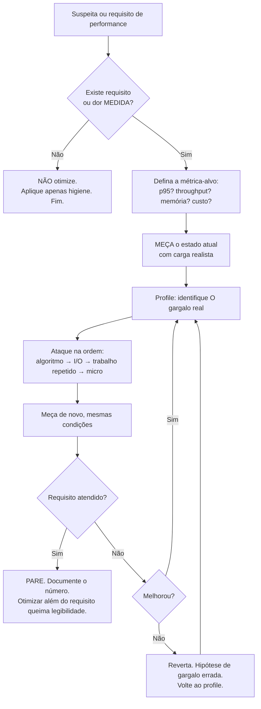

# PERFORMANCE.md — Metodologia Completa de Otimização de um Agente de IA

> Engenharia reversa do comportamento observável ao analisar e otimizar performance. O método em uma linha: **medir → atacar o gargalo real na ordem de maior retorno → medir de novo → parar no requisito.** Parte da série iniciada em `WORKFLOW.md`.

---

## Índice

1. [O processo de decisão de otimização](#1-o-processo-de-decisão)
2. [Quando otimizar / quando NÃO otimizar](#2-quando-otimizar--quando-não)
3. [Complexidade Big-O na prática](#3-complexidade-big-o-na-prática)
4. [Profiling: encontrando gargalos](#4-profiling)
5. [Benchmarking honesto](#5-benchmarking)
6. [CPU](#6-cpu)
7. [Memória (RAM)](#7-memória-ram)
8. [Banco de dados e queries](#8-banco-de-dados-e-queries)
9. [Cache](#9-cache)
10. [Rede](#10-rede)
11. [Escalabilidade vertical vs horizontal](#11-escalabilidade-vertical-vs-horizontal)
12. [Higiene vs otimização: a tabela definitiva](#12-higiene-vs-otimização)

---

## 1. O processo de decisão



Três invariantes do processo:

1. **Sem medição, sem otimização.** A intuição sobre gargalos erra com frequência humilhante; otimizar sem perfil é adivinhar com efeitos colaterais.
2. **Um gargalo por vez.** Depois de cada mudança, medir — o gargalo muda de lugar (a lei do gargalo: otimizar o que não é gargalo não muda o total).
3. **Critério de parada explícito.** O requisito (SLA, budget, ou derivado: ~100ms para "instantâneo", ~1s para manter fluxo) define o fim. Sem critério, a otimização não termina — ela apenas consome legibilidade indefinidamente.

---

## 2. Quando otimizar / quando NÃO

### Otimize quando (qualquer um):
- Há **requisito explícito** (SLA, p95, orçamento de custo de infra) não atendido.
- Há **dor medida** (usuários esperando, timeout, fila crescendo, conta de cloud subindo).
- É **higiene** — as práticas da seção 12 que não custam legibilidade: essas se aplicam sempre, sem pedir medição.
- A decisão é **estrutural e irreversível na prática** (formato de dados, particionamento, protocolo): aqui a análise de performance acontece ANTES, porque depois não dá.

### NÃO otimize quando:
- Não há número — nem requisito, nem medição de dor. ("Pode ficar lento" não é número.)
- O ganho está fora do gargalo (otimizar 2% do tempo total em 90% ainda deixa 98,2%).
- O ganho é micro e o custo é legibilidade (o `++i` vs `i++` da vida; o compilador/JIT faz melhor).
- O código roda uma vez no boot / é ferramenta interna de 3 usos / é protótipo declarado.
- O requisito já foi atingido. **Parar é uma decisão de engenharia**, não preguiça.

### O erro simétrico

"Otimização prematura é a raiz de todo mal" tem um irmão igualmente caro: **pessimização gratuita** — escolher a estrutura O(n²) quando a O(n) era igualmente legível, fazer 4 queries onde 1 join era óbvio. A frase de Knuth não é licença para escrever código negligente; é contra sacrificar clareza por ganhos não medidos. Clareza e eficiência razoável raramente conflitam — quando não conflitam, escolho os dois.

---

## 3. Complexidade Big-O na prática

Big-O é a primeira lente porque é a única que muda a **classe** do comportamento, não a constante.

### Onde o O(n²) se esconde (os padrões que procuro em revisão):

- `list.includes/indexOf/find` **dentro de loop** sobre outra lista → Set/Map torna O(n).
- Concatenação de string/array em loop com cópia (`s += chunk`, `arr = [...arr, x]`) → builder/push.
- `sort` dentro de loop; sort para achar só o máximo (O(n log n) onde O(n) basta).
- Query dentro de loop (N+1) — é o O(n) de round-trips, a pior constante que existe (ver §8).
- Regex catastrófica (backtracking exponencial) em entrada de usuário — além de lento, é DoS (ReDoS).
- Recursão sem memoização em subproblemas repetidos.
- Deleção/inserção no meio de array em loop (O(n) por operação → O(n²) total).

### As perguntas de calibragem:

1. **Qual é o n real, hoje e em 2 anos?** n=50 fixo: qualquer complexidade serve, escolha a legível. n crescendo com o negócio: a classe importa mais que qualquer micro-otimização.
2. **Com que frequência roda?** O(n²) numa migração única ≠ O(n²) por requisição.
3. **Memória também tem Big-O:** carregar a tabela inteira para processar em streaming-de-um é O(n) de RAM desnecessário (ver §7).

**Heurística de escolha de estrutura:** membership/dedupe → Set; lookup por chave → Map/dict; fila com prioridade → heap; busca em faixa ordenada → árvore/array ordenado + busca binária. A estrutura certa costuma eliminar o algoritmo esperto.

---

## 4. Profiling

**Profiling responde "onde o tempo/memória realmente vai" — a pergunta que a intuição responde errado.**

### Método observável:

1. **Carga realista:** perfil com dados de brinquedo mente. Volume, distribuição e concorrência próximos do real (ou o próprio ambiente real com profiler de baixo overhead).
2. **Ferramenta por camada:**
   - Aplicação: profiler da linguagem (py-spy/cProfile; clinic/`--cpu-prof` para Node; pprof para Go; async-profiler para JVM) — flame graph como leitura padrão.
   - Banco: `EXPLAIN (ANALYZE, BUFFERS)`, slow query log, `pg_stat_statements`.
   - Rede/serviços: tracing distribuído (spans revelam o serviço/salto culpado).
   - Frontend: DevTools Performance, Lighthouse, waterfall de rede.
   - Sistema: `top/htop`, iostat, métricas de container (CPU throttling!, memória, GC).
3. **Ler o flame graph procurando:** as torres largas (onde o tempo mora), o inesperado (serialização tomando 40%? logging síncrono? regex?), e o que **não** aparece (se a CPU está ociosa e a requisição demora → o tempo está em espera de I/O — profiler de CPU não mostra; olhar wall time/traces).
4. **Distinguir latência de throughput e média de cauda:** otimizar a média não resolve o p99 (que costuma ser lock, GC, cold cache, retry). O alvo do usuário é a cauda.

---

## 5. Benchmarking

Benchmark é experimento — as regras da ciência valem:

- **Compare A e B mudando só a variável em teste**, mesmos dados, mesma máquina, mesmas condições térmicas/vizinhança.
- **Aquecimento** (JIT, caches, pools) antes de medir; N execuções; reportar mediana + percentis (nunca uma execução, nunca só média).
- **Cuidado com o otimizador:** microbenchmark cujo resultado não é usado pode ser eliminado pelo compilador — medir trabalho que "sumiu". Usar harness maduro (JMH, pytest-benchmark, criterion, hyperfine).
- **Dados realistas:** ordenação/duplicação/tamanho da entrada mudam tudo (o quicksort no pior caso, o hash com colisões, o branch predictor).
- **Registrar o número no lugar da decisão:** o comentário/PR que justifica a otimização carrega o antes/depois ("p95 800ms→90ms, dataset X, 2026-07"). Números sem contexto expiram.

---

## 6. CPU

Sinais: CPU alta com throughput baixo; p50 já alto (não só cauda); flame graph com torres de computação.

**Ordem de ataque:**
1. **Algoritmo/estrutura** (§3) — sempre primeiro; é onde moram os 10–1000×.
2. **Trabalho desnecessário:** serialização/parse repetido (JSON parse do mesmo payload 3 vezes na pipeline), logging síncrono verboso em hot path, validação redundante em camadas, criptografia/compressão mal calibrada, regex recompilada em loop.
3. **Trabalho repetido → memoize/precompute:** o que não muda por iteração sai do loop; o que não muda por requisição vira cache (§9); o que não muda nunca vira constante/build-time.
4. **Paralelismo de CPU** — por último, porque adiciona complexidade real: dividir trabalho CPU-bound entre cores (workers/processos/threads conforme o runtime; em Node/Python, lembrar que o loop de eventos/GIL não paraleliza CPU — é worker/processo, não async).
5. Micro-otimizações (layout de memória, branchless, SIMD) — apenas com perfil apontando, requisito apertado e comentário justificando.

**Armadilha específica de containers:** CPU *throttling* por limite de quota — o serviço "lento" que na verdade está sendo estrangulado; checar métricas de throttle antes de otimizar código.

---

## 7. Memória (RAM)

Sinais: OOM kills, GC dominando o perfil, swap, custo de instância crescendo, latência de cauda serrilhada (pausas de GC).

**Padrões que procuro:**
- **Carregar o dataset inteiro para processar item a item** → streaming/iteração paginada/cursor. O padrão nº 1 de OOM em jobs.
- **Vazamentos lógicos:** cache sem teto/TTL (§9), listeners/subscriptions nunca removidos, closures capturando estruturas grandes, coleções "temporárias" em singleton/módulo que só crescem.
- **Retenção acidental:** guardar o objeto gigante inteiro quando só 2 campos eram necessários (a referência segura o grafo todo); substring/slice que retém o buffer original (conforme runtime).
- **Duplicação de dados em pipeline:** cada etapa materializando uma cópia transformada do dataset → transformar em streaming/generator.
- **Pressão de alocação:** milhões de objetos pequenos efêmeros em hot path (GC churn) → reutilizar buffers, evitar boxing, processar em lote.

**Método:** heap snapshot/profiler de alocação → o que domina? quem retém? → cortar a retenção na raiz. E a pergunta de design que evita o problema: "qual é o tamanho máximo que isto pode atingir em produção — e o que o limita?" Toda estrutura que cresce precisa de um limitador nomeável (paginação, TTL, teto, backpressure).

---

## 8. Banco de dados e queries

Onde moram 80% dos problemas de performance de aplicações de negócio. Ordem de investigação:

1. **N+1** — a query em loop. Sintoma: latência proporcional ao tamanho da lista; log com centenas de queries idênticas. Correção: join, `IN (...)`, batch, dataloader, eager loading do ORM (conferindo o SQL que o ORM gera — ORMs escondem N+1 atrás de lazy loading).
2. **Falta de índice** — `EXPLAIN` mostrando seq scan em tabela grande com filtro seletivo. Criar o índice **para o padrão de consulta real** (composto na ordem certa: igualdade → range; cobrindo quando vale). Lembrar: cada índice custa em escrita e RAM — índice não usado é puro custo (`pg_stat_user_indexes` para auditar).
3. **Query que traz demais:** `SELECT *` para usar 2 campos; sem `LIMIT`; sem paginação; carregar para contar (`COUNT` no banco!) ou filtrar em memória o que o `WHERE` faria.
4. **Query estruturalmente cara:** `OR` que impede índice, função sobre a coluna no WHERE (`WHERE lower(email) =` sem índice funcional), `LIKE '%x'`, DISTINCT/ORDER BY sem índice em milhões de linhas, OFFSET gigante (paginação por cursor/keyset resolve).
5. **Locks e transações:** transação longa (com I/O externo dentro!) segurando locks; hot row (contador global) serializando tudo; deadlocks por ordem inconsistente de aquisição.
6. **Pool de conexões:** esgotado (requisições esperando conexão — parece "banco lento", é fila no pool); ou superdimensionado (mais conexões que o banco aguenta → colapso sob pico).
7. **Depois de tudo isso:** réplicas de leitura, materialized views, particionamento — infraestrutura só depois que as queries estão honestas.

---

## 9. Cache

(Design completo em `ARCHITECTURE.md` §11; aqui, o ângulo de performance.)

- **Cache é a SEGUNDA ferramenta.** Primeiro corrige-se a query/algoritmo; cache sobre código ruim esconde o problema e adiciona staleness. A exceção honesta: resultado caro *por natureza* (agregação pesada, chamada de terceiros paga/lenta).
- **Antes de adicionar: hit rate projetado.** Cache de item raramente re-lido = complexidade sem ganho. Medir depois: hit rate real como métrica.
- **Onde no stack (do mais barato ao mais caro):** browser/HTTP (`Cache-Control`, ETag — de graça e esquecido), CDN para estático/semi-estático, aplicação (memoize local), distribuído (Redis), materialização no banco.
- **Os três problemas clássicos em produção:**
  - **Stampede:** expirou → mil misses recomputam juntos → derruba a origem. Mitigar: single-flight/lock, TTL com jitter, refresh antecipado.
  - **Staleness invisível:** um caminho de escrita esquecido de invalidar → dado velho para sempre. Mitigar: TTL sempre como rede de segurança, invalidação centralizada nos caminhos de escrita.
  - **Chave incompleta:** faltou tenant/idioma/versão na chave → resposta errada (e vazamento entre clientes — incidente de segurança). Revisar a chave contra TODAS as dimensões da resposta.

---

## 10. Rede

A rede costuma dominar a latência percebida — e é onde otimizações baratas rendem muito:

- **Round-trips antes de bytes:** o custo dominante é a viagem, não o tamanho. Eliminar viagens: batch de chamadas, resolver N+1 de API (endpoint que aceita lista de IDs), evitar cascatas (A espera B para chamar C quando B e C eram independentes → paralelizar com `Promise.all`/`gather`, com limite de concorrência).
- **Menos bytes:** compressão (gzip/brotli — checar se está LIGADA; frequentemente não está), payload enxuto (campos usados, não o objeto inteiro), imagens dimensionadas/formatos modernos, bundle com code-splitting.
- **Conexões reutilizadas:** keep-alive/pool de conexões HTTP para chamadas repetidas ao mesmo host (o handshake TCP+TLS por chamada é um imposto silencioso); HTTP/2 para multiplexar.
- **Proximidade:** CDN para estáticos; região do servidor perto do usuário/do banco (aplicação numa região e banco em outra = imposto em TODA query).
- **Tolerância a falha com orçamento:** timeout explícito em toda chamada (menor que o timeout de quem me chama!), retry com backoff+jitter só em erro transiente e operação idempotente — retry mal calibrado é amplificador de incidente (tempestade).
- **Percepção:** streaming de resposta (primeiro byte cedo), skeleton/optimistic UI, carregar sob demanda — às vezes a "otimização" certa é entregar a mesma latência *parecendo* instantânea.

---

## 11. Escalabilidade vertical vs horizontal

```
Preciso de mais capacidade. O que faço?
│
├─ 0. Já otimizei o que roda? (§3–§10)
│     Pagar por mais máquina para rodar N+1 é assinar o desperdício.
│
├─ 1. VERTICAL primeiro (mais CPU/RAM na mesma máquina)
│     ├─ Prós: zero mudança de código, sem complexidade nova.
│     ├─ Contras: teto físico, custo cresce superlinear no topo,
│     │          continua ponto único de falha.
│     └─ Até onde: enquanto o upgrade for barato e o teto distante.
│        (Um Postgres grande e bem indexado atende MUITO mais do
│         que a intuição sugere.)
│
├─ 2. HORIZONTAL para a APLICAÇÃO (mais instâncias atrás de LB)
│     ├─ Pré-requisito: instâncias STATELESS (sessão/estado em
│     │  banco ou cache compartilhado) — a decisão barata tomada
│     │  no dia 1 que paga aqui.
│     └─ Custo: pequeno (LB, health checks, deploy rolling).
│        É o passo com melhor custo-benefício — por isso stateless
│        é higiene, não otimização.
│
├─ 3. HORIZONTAL para LEITURA de dados (réplicas de leitura)
│     └─ Custo novo: lag de replicação → ler o que acabou de
│        escrever exige leitura no primário (read-your-writes).
│        Roteamento leitura/escrita no código.
│
└─ 4. HORIZONTAL para ESCRITA (sharding/particionamento)
      └─ O último recurso: muda o modelo de programação
         (transações cross-shard, re-sharding, hot shards,
         queries globais viram scatter-gather).
         Só com evidência de que 1–3 esgotaram.
```

**Regra transversal:** escalar também é **degradar com dignidade** — backpressure, limites de fila, timeouts, circuit breakers, load shedding. O sistema que "escala" mas colapsa em cascata no pico não escala; ele apenas adia o incidente.

---

## 12. Higiene vs otimização

A distinção operacional mais importante do documento. **Higiene** se aplica sempre, sem medição, porque não custa legibilidade. **Otimização** exige medição, porque custa.

| HIGIENE (faça sempre) | OTIMIZAÇÃO (só com medição) |
|---|---|
| Não fazer query em loop (N+1) | Desnormalizar schema |
| Set/Map para membership em coleção que cresce | Trocar estrutura por variante exótica |
| Paginar toda listagem | Cursor keyset ultra-otimizado |
| `SELECT` só do necessário; `COUNT` no banco | Materialized views |
| Paralelizar I/O independente (com limite) | Paralelismo de CPU (workers) |
| Compressão HTTP ligada; conexões reutilizadas | Protocolo binário custom |
| Índice para o padrão de consulta novo | Índice parcial/cobertor fino |
| Streaming para dataset grande | Zero-copy, buffers reutilizados |
| Timeout + backoff com jitter | Tuning fino de retry/pool |
| Não recomputar o invariante dentro do loop | Memoização com invalidação complexa |
| Cache HTTP básico (ETag/Cache-Control) | Camada de cache distribuído |
| Instâncias stateless | Sharding |

**O contrato da otimização cara:** quando uma otimização custa legibilidade, ela deixa no código o comentário com o porquê e o número ("evita reparse; p95 800→90ms, 2026-07"), e no PR a medição antes/depois. Otimização sem número documentado vira superstição que ninguém ousa remover.
