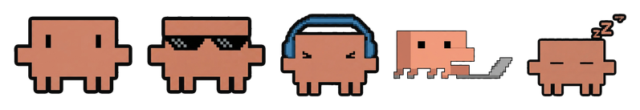

# Claude Status Bar — Arch Linux & Windows

A lightweight **system-tray** status indicator for [Claude Code](https://claude.com/claude-code).
Tab away during a long thinking stretch and still see, at a glance, whether
Claude is **working**, **waiting on you**, or **done**.

This is a cross-platform recreation of the macOS-only
[m1ckc3s/claude-status-bar](https://github.com/m1ckc3s/claude-status-bar),
rebuilt in Python so it runs natively in the tray on **Arch Linux**
(AppIndicator/KStatusNotifierItem) and **Windows** (native Win32 tray).

It uses the **original app's assets**: the official Claude spark mark as the
resting icon, the claude.ai thinking-spark morphing animation, the pixel-art
**Clawd crab-walking** animation, the app icon and the completion chime.


| State | Icon | Meaning |
|-------|------|---------|
| Idle | Claude spark logo | No active work — Claude is at rest |
| Working | animated spark / spinner / Clawd + timer | Claude is thinking or running a tool (shows elapsed time and the current action: *Editing*, *Reading*, *Running command*, …) |
| Awaiting permission | amber dot | Claude needs you to approve something |
| Done | logo + green check (chime) | The turn finished, then returns to idle |

It aggregates status across **multiple simultaneous Claude Code sessions** and
prioritises any session waiting on your input.

---

## How it works

Claude Code fires *hooks* during a session. Small, dependency-free Python hooks
write a tiny JSON file per session to:

```
~/.claude/statusbar/state.d/<session_id>.json
```

The tray app polls that folder a few times a second, aggregates the states, and
animates the tray icon. Everything is local — **no network access**, no
telemetry. Writes are atomic (temp file + rename) so the UI never sees a
half-written file.

```
Claude Code ──hook──▶ hooks/update.py ──▶ state.d/<id>.json ──poll──▶ tray icon
```

The hook → state protocol is compatible with the original project, including the
tool-to-label mapping (`Bash → Running command`, `Edit → Editing`,
`Read → Reading`, `Grep/Glob → Searching`, `WebFetch → Browsing web`, …).

---

## Requirements

- **Claude Code** (CLI or desktop)
- **Python 3.8+**
- Tray dependencies: `pystray` and `Pillow` (the hooks themselves need only the
  standard library)

### Arch Linux extras

A status-notifier host and GTK/AppIndicator bindings:

```bash
sudo pacman -S python-gobject gtk3 libayatana-appindicator
# KDE Plasma and XFCE show tray icons out of the box.
# On GNOME, install the "AppIndicator and KStatusNotifierItem Support" extension.
```

### Windows extras

None — the native tray is used. (Optional but recommended: use `pythonw.exe`
so no console window appears; the provided launchers do this for you.)

---

## Install

```bash
git clone https://github.com/fabiolukas123/fabiolukas123.git claude-status-bar
cd claude-status-bar
pip install -r requirements.txt      # pystray + Pillow
python install.py                    # wires the hooks into ~/.claude/settings.json
```

`install.py` merges the hooks into `~/.claude/settings.json` (backing up your
existing file first) **without touching any other hooks you already have**, and
uses your current Python interpreter with absolute script paths. Re-running it
is safe and idempotent.

Then start the tray:

```bash
python -m statusbar
```

Open a new Claude Code session and the tray will start reflecting its status.

> Hooks are loaded when a Claude Code session starts, so restart any open
> sessions (or run `/hooks` to confirm they're registered) after installing.

### Run it automatically at login

**Arch Linux** (systemd user service + XDG autostart fallback):

```bash
bash packaging/arch/install-autostart.sh
# manage: systemctl --user {status,restart,stop} claude-status-bar
```

**Windows** (Startup-folder shortcut, launched silently via `pythonw`):

```powershell
powershell -ExecutionPolicy Bypass -File packaging\windows\install-autostart.ps1
```

There are also one-shot convenience launchers that create a venv on first run:
`scripts/run.sh` (Linux) and `scripts\run.bat` (Windows).

---

## Configuration

Right-click the tray icon for a menu with live toggles (persisted to
`~/.claude/statusbar/config.json`):

- **Show timer** — elapsed time while Claude works
- **Completion sound** — the original completion chime when a turn finishes
- **Animation** — *Claude Spark* (the claude.ai morphing spark),
  *Claude Code spinner*, or *Crab Walking* (Clawd pixel art)
- **Idle icon** — the classic Clawd (default) or the Claude logo, plus the
  other Clawd poses (sunglasses, headphones, notebook, sleeping):

  
- **Auto poses** — when enabled (default), poses appear automatically:
  - **Sleeping** after Claude Code has been idle for over an hour
    (`sleep_after_minutes` in config.json, 0 disables)
  - **Headphones** while Spotify is running on the machine (idle only;
    sleeping wins if both apply)
  - **Notebook** while a **Cowork** session is working — Windows only, since
    Cowork doesn't exist for Linux. The icon gently bobs so it still reads
    as "busy", and the tooltip gains a "(Cowork)" tag. Detection: the
    session's entrypoint matches `cowork_markers` from
    `~/.claude/statusbar/config.json` (default `["cowork", "desktop"]`),
    or the session wasn't launched from a terminal while the Claude desktop
    app is running.
- **Codex icon** — a second tray icon for the OpenAI Codex CLI, shown while
  a `codex` process is running (most trays place it left of Clawd; on
  Windows you can drag to reorder). It shows `>_` at rest and animates
  `>.` → `>..` → `>...` while Codex writes to its session logs
  (`~/.codex/sessions`). Hide it via the "Codex icon" toggle.
- **Status badge** — a small glyph beside the icon showing what Claude is
  doing: thought dots (thinking), a terminal (running a command), a pencil
  (editing/writing), a magnifier (reading/searching), a globe (web), a gear
  (other tools) and a blinking amber "!" while awaiting permission (the
  resting icon stays visible under it; with the badge off, permission shows
  the classic solid amber dot instead)
- **Usage meters** — the top of the dropdown shows how much of each limit is
  estimated to be used, as text bars:

  ```
  5h   ▮▮▮▮▮▮▮▯▯▯ 66% · reseta 01:00
  7d   ▮▮▮▮▮▮▮▮▯▯ 87% (estimado)
  ```

  Anthropic exposes no local API for subscription limits, so this reads the
  per-message token usage Claude Code writes to `~/.claude/projects/**.jsonl`
  and reconstructs the 5-hour block and rolling 7-day window (same approach
  as ccusage). Budgets are auto-calibrated to the largest block/week seen in
  the last 60 days — accurate once you've hit the limit at least once — or
  can be pinned in `~/.claude/statusbar/config.json` via `limit_5h_tokens` /
  `limit_week_tokens`. Treat the percentages as estimates.
- **Icon colour** — *Claude orange* or *System* (neutral ink; Clawd is
  converted with the upstream brightness→opacity mapping so the sprite keeps
  its depth, eyes punched out as negative space)
- **Open state folder** — jump to `state.d/`
- **Quit**

When more than one session is active, each session gets its own line in the
dropdown, with any session awaiting permission listed first.

---

## Arch packaging (AUR-style)

A `PKGBUILD` is provided in `packaging/arch/`. Point its `source` at a release
tarball or `git+https` URL, then:

```bash
cd packaging/arch
makepkg -si
```

It installs the `statusbar` module, a `claude-status-bar` launcher, and a
`.desktop` entry, pulling in `python-pystray`, `python-pillow`,
`python-gobject`, `gtk3` and `libayatana-appindicator`.

---

## Uninstall

```bash
python uninstall.py            # remove only our hooks from settings.json
python uninstall.py --purge    # also delete ~/.claude/statusbar
```

Disable autostart by removing the systemd user service / `~/.config/autostart`
entry (Linux) or the **Claude Status Bar** shortcut in your Startup folder
(Windows).

---

## Project layout

```
hooks/            Claude Code hooks (pure stdlib, never crash a session)
  _common.py        shared state-file helpers + tool→label map
  lifecycle.py      SessionStart/SessionEnd
  update.py         prompt / pre / post / notify / permreq / stop
  hooks.json        plugin-style hook manifest (reference)
statusbar/        the tray app
  app.py            pystray tray + poll loop + menu
  state.py          read & aggregate the per-session state files
  icons.py          renders the original assets (logo, spark, Clawd) + badges
  usage.py          estimates 5h/weekly limit usage from local transcripts
  procs.py          psutil-free process detection (Spotify / Claude desktop)
  codex.py          OpenAI Codex CLI activity detection (companion icon)
  config.py         paths, colours, persisted settings
  sound.py          plays the original completion.mp3 (with fallbacks)
  assets/           upstream assets: logo.png, spark/ (8 frames),
                    clawd/ (20 frames + poses/), completion.mp3,
                    app.png/.ico/.icns
install.py        merge hooks into ~/.claude/settings.json
uninstall.py      remove them again
packaging/        arch/ (PKGBUILD, systemd, desktop) and windows/ (ps1, vbs)
scripts/          run.sh / run.bat convenience launchers
tests/            headless tests for the hook→state→aggregate pipeline
```

## Tests

```bash
python tests/test_state.py    # no GUI deps required
```

## Troubleshooting

- **No tray icon on GNOME** — install the *AppIndicator and KStatusNotifierItem
  Support* extension; GNOME hides legacy tray icons by default.
- **`ValueError: Could not find a backend`** on Linux — install
  `python-gobject gtk3 libayatana-appindicator`.
- **Status never updates** — confirm the hooks are registered (`/hooks` inside
  Claude Code) and that new sessions were started *after* running `install.py`.
- **Stale sessions linger** — files whose process has exited, or that are older
  than 6 hours, are swept automatically on the next poll; `SessionEnd` removes
  them immediately under normal exit.

## Credits

Concept, assets (Claude spark logo/animation frames, Clawd crab-walking
sprite, app icon, completion chime) and the macOS original by
[m1ckc3s](https://github.com/m1ckc3s/claude-status-bar) (MIT). This
cross-platform rebuild is independent and MIT-licensed.
